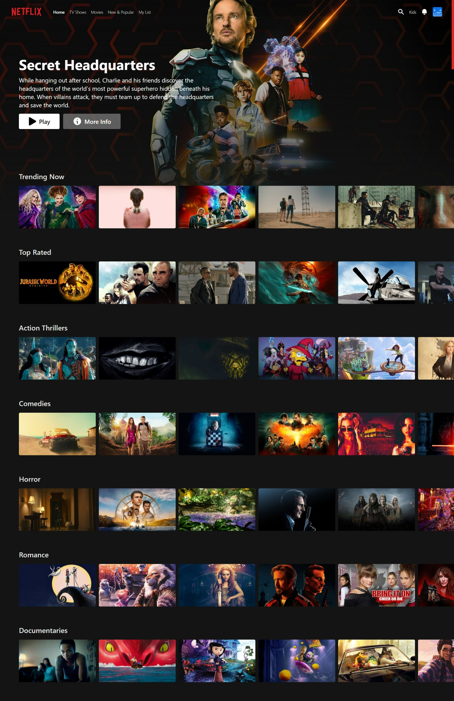

# Netflix-redesign

## Table of Contents

- [Overview](#overview)
  - [Screenshot](#home-page-preview)
  - [Links](#links)
- [My process](#my-process)
  - [Built with](#built-with)
  - [Features](#features)

----

## Overview

Welcome to my website on creating a netflix clone.

## Links

- Live Site Link: [Click Here](https://netflix-redesign-task.vercel.app/) to see the Live website.
- Client side Github Repo: [Click Here](https://github.com/kamrulsaad/netflix-redesign-task) to check my client side github repo for this project.

## Home Page Preview

----

## My Process

I have built this website following the requirements provided.

## Future Process

I would like to implement the search functionality using `redux` architecture and create a much more dynamic working UI for the better understanding of my skills.

## Built With

- `react`, `react-dom`
- `react-query`
- `react-icons`
- `react-router-dom`
- `redux`, `react-redux`, `redux-toolkit` 
- `tailwindCSS`
- `tailwind-scrollbar`
- `tailwind-scrollbar-hide`
- `tailwindcss-textshadow`
------

## Features

Users should be able to:

- See a Beautiful and responsive  home page
- See dynaminc data for the movies
- CLicking on the movies at the top navbar will take user the 'all movies' page. 
- In the 'all movies' page, pagination and filtering by year feature can be experienced
- CLicking on the movie thumbnails will redirect the user to details page of that movie. 